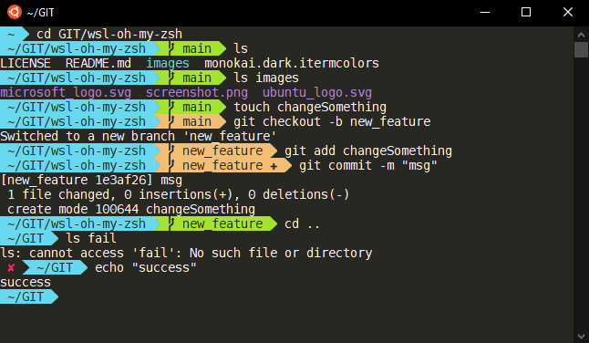

# Set WSL shell to [zsh](http://zsh.sourceforge.net/) with [oh-my-zsh](https://ohmyz.sh/)

   

## Preparation
1. [Install WSL Ubuntu 20.04](https://docs.microsoft.com/en-us/windows/wsl/install-win10)
2. Download and extract [ColorTool](https://github.com/Microsoft/Terminal/tree/main/src/tools/ColorTool#installing)
3. Grab a color theme from [terminal.sexy](https://terminal.sexy/) and export it to `..\ColorTool\schemes`
    * Or download `monokai.dark.itermcolors` from this repository
4. Apply it in Windows command prompt with `ColorTool.exe -b <theme-file>` (this sets it for WSL **and the Windows command prompt!**)
    * To restore the default color theme run `ColorTool.exe -b schemes\campbell.ini`

##  Windows command prompt
1. Download Powerline Fonts: `git clone https://github.com/powerline/fonts.git --depth=1`
2. Install Fonts `cd fonts && powershell -ExecutionPolicy Bypass -File .\install.ps1`
3. Remove `fonts` folder

##  WSL Ubuntu 20.04 bash
1. Click Ubuntu icon in top left corner and select properties &#8594; set font to `DejaVu Sans Mono Powerline`
2. Install zsh: `sudo apt install zsh`
3. Set zsh as default shell: `sudo chsh -s $(which zsh)`
4. Restart the shell and verify `echo $SHELL` prints `/usr/bin/zsh`
5. Install oh-my-zsh with `sh -c "$(curl -fsSL https://raw.githubusercontent.com/ohmyzsh/ohmyzsh/master/tools/install.sh)"`
6. Edit .zshrc file:
    * replace the old value: `ZSH_THEME="agnoster"` ([more themes](https://github.com/ohmyzsh/ohmyzsh/wiki/Themes))
    * add this to remove username@host from prompt: `DEFAULT_USER="$USER"`

## Additional resources
* Further [customization](https://github.com/ohmyzsh/ohmyzsh/wiki/Customization)
* Bookmark [oh-my-zsh cheatsheet](https://github.com/ohmyzsh/ohmyzsh/wiki/Cheatsheet) :)
* Have a look at [optional oh-my-zsh plugins](https://github.com/ohmyzsh/ohmyzsh/wiki/Plugins)

Enjoy!
